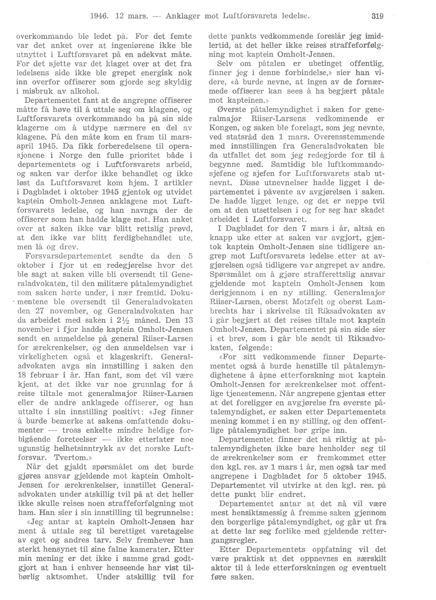
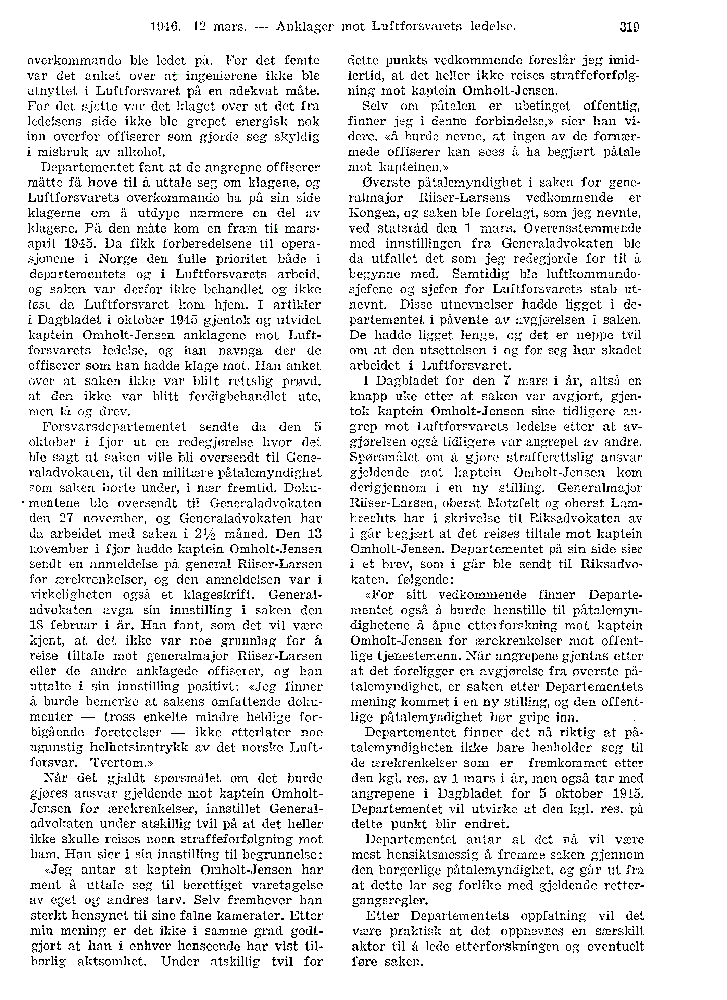
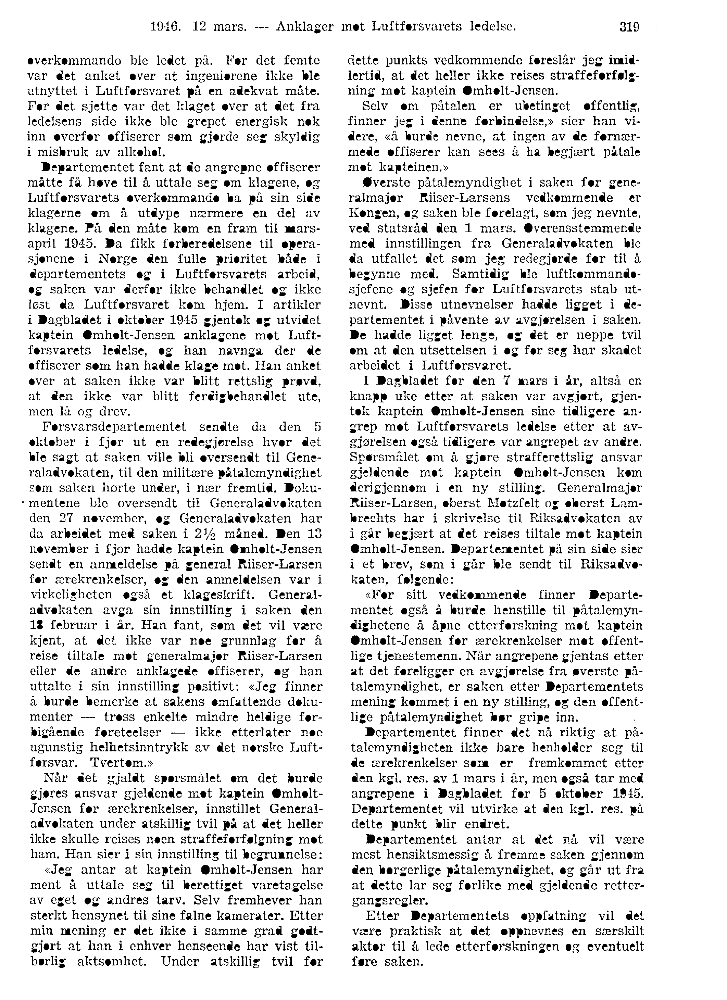

# stortingOCR

### Image converting

1. Getting pdfs and splitting into single pages at the following quality:

  

2. Converting to .png format, changing DPI to 300x300 (optimal for tesseract), and shaving of the edges:

  

3. Removing some of the gray noise with LAT (20x20x20%) and enhance blackness of text:

  

4. Making a baseline image with -connected-components:

  

5. The same operation as previous point, only now removing spots of black that are less than 15 pixels big:

  

6. Then take the difference between the two previous operations making a black background with spots of white where the noise filtered out in step 5 was:

  

7. Finally, take the difference between the image from step 3 and 6 to remove the noise:

  

8. Run `tesseract` on the final image to get the result:
___
1916. 12 mars. —— Anklager mot Luftforsvarets ledelse. 319

overkommando ble ledet på. For det femte
var det anket over at ingeniørene ikke ble
utnyttet i Luftforsvaret på en adekvat måte.
For det sjette var det klaget over at det fra
ledelsens side ikke ble grepet energisk nok
inn overfor offiserer som gjorde seg skyldig
i misbruk av alkohol.

Departementet fant at de angrepne offiserer
måtte få høve til å uttale seg om klagene, og
Luftforsvarets overkommando ha på sin side
klagerne om å utdype nærmere en del av
klagene. Pir den måte kom en fram til mars-
april 1915. Da fikk forberedelsene til opera-
sjonene i Norge den fulle prioritet både i
departementets og i Luftforsvarets arbeid,
og saken var derfor ikke behandlet og ikke
lest da Luftforsvaret kom hjem. I artikler
i Dagbladet i oktober 1915 gjentok og utvidet
kaptein Omholt—Jensen anklagene mot Luft-
forsvarets ledelse, og han navnga der de
offiserer som han hadde klage mot. Han anket
over at saken ikke var blitt rettslig prøvd,
at den ikke var blitt ferdigbehandlet ute,
men lå og drev.

Forsvarsdepartementet sendte da den 5
oktober i fjor ut en redegjørelse hvor det
ble sagt at saken ville bli oversendt til Gene-
raladvokaten, til den militære påtalemyndighet
som saken hørte under, i nær fremtid. Doku-

-mentene ble oversendt til Generaladvokaten
den 27 november, og Generaladvokaten har
da arbeidet med saken 1 21,5 måned. Den 13
november i fjor hadde kaptein Omholt-Jensen
sendt en anmeldelse på general Riiser-Larsen
for ærekrenkelser, og den anmeldelsen var 1
virkeligheten også et klageskrift. General—
advokaten avga sin innstilling i saken den
18 februar i år. Han fant, som det vil være
kjent, at det ikke var noe grunnlag for å
reise tiltale mot generalmajor Riiser-Larsen
eller de andre anklagede offiserer, og han
uttalte i sin innstilling positivt: <Jeg finner
a burde bemerke at sakens omfattende doku-
menter -— tross enkelte mindre heldige for-
bigående foreteelser —— ikke etterlater noe
ugunstig helhetsinntrykk av det norske Luft—
forsvar. Tvertom.»

Når det gjaldt spørsmalet om det burde
gjøres ansvar gjeldende mot kaptein Omholt—
Jensen for ærekrenkelser, innstillet General-
advokaten under atskillig tvil på at det heller
ikke skulle reises noen straffeforfølgning mot
ham. Han sier i sin innstilling til begrunnelse:

Jeg antar at kaptein Omholt-Jensen har
ment å uttale seg til berettiget varetagelse
av eget og andres tarv. Selv fremhever han
sterkt hensynet til sine falne kamerater. Etter
min mening er det ikle i samme grad godt-
gjort at han i enhver henseende har vist til-
børlig aktsomhet. Under atskillig tvil for

dette punkts vedkommende foreslår jeg imid-
lertid, at det heller ikke reises straffeforfølg-
ning mot kaptein Omholt-Jensen.

Selv om påtalen er ubetinget offentlig,
finner jeg i denne forbindelse,> sier han vi-
dere, «å burde nevne, at ingen av de fornær-
mede offiserer kan sees å ha begjært påtale
mot kapteinen.»

Øverste påtalemyndighet i saken for gene-
ralmajor Riiser—Larsens vedkommende er
Kongen, og saken ble forelagt, som jeg nevnte,
ved statsråd den 1 mars. Overensstemmende
med innstillingen fra Generaladvokaten ble
da utfallet det som jeg redegjorde for til å
begynne med. Samtidig ble luftkommando-
sjefene og sjefen for Luftforsvarets stab ut-
nevnt. Disse utnevnelser hadde ligget i de-
partementet i påvente av avgjørelsen i saken.
De hadde ligget lenge, og det er neppe tvil
om at den utsettelsen i og for seg har skadet
arbeidet i Luftforsvaret.

I Dagbladet for den 7 mars i år, altså en
knapp uke etter at saken var avgjort, gjen-
tok kaptein Omholt—Jensen sine tidligere an-
grep mot Luftforsvarets ledelse etter at av—
gjørelsen også tidligere var angrepet av andre.
Spørsmålet om å gjøre strafferettslig ansvar
gjeldende mot kaptein Omholt-Jensen kom
derigjennom i en ny stilling. Generalmajor
Riiser-Larsen, oberst Motzfelt og oberst Lam-
breehts har i skrivelse til Riksadvokaten av
i går begjært at det reises tiltale mot kaptein
Omholt-Jensen. Departementet på sin side sier
i et brev, som i går ble sendt til Riksadvo-
katen, følgende:

«For sitt vedkommende finner Departe-
mentet også å burde henstille til påtalemyn-
dighetene å. åpne etterforsizning mot kaptein
Omholt-Jensen for ærekrenkelser mot offent-
lige tjenestemenn. Når angrepene gjentas etter
at det foreligger en avgjørelse fra øverste på—
talemyndighet, er saken etter Departementets
mening kommet i en ny stilling, og den offent-
lige påtalemyndighet ber gripe inn.

Departementet finner det nå riktig at på-
talemyndigheten ikke bare henholder seg til
de ærekrenkelser som er fremkommet etter
den kgl. res. av 1 mars i år, men også tar med
angrepene i Dagbladet for 5 oktober 1945.
Departementet vil utvirke at den kgl. res. på
dette punkt blir endret.

Departementet antar at det nå vil være
mest hensiktsmessig å fremme saken gjennom
den borgerlige påtalemyndighet, og går ut fra
at dette lar seg forlike med gjeldende retter—
gangsregler.

Etter Departementets oppfatning vil det
være praktisk at det oppnevnes en særskilt
aktor til å lede etterforskningen og eventuelt
føre saken.

___
