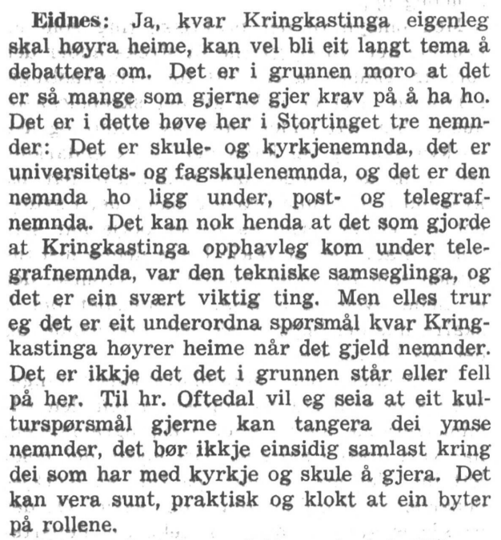
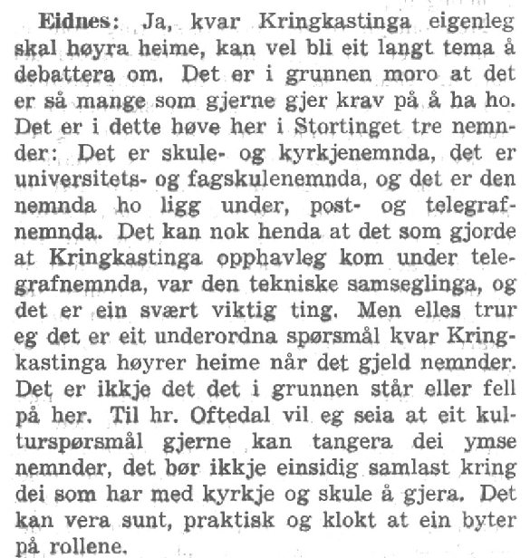
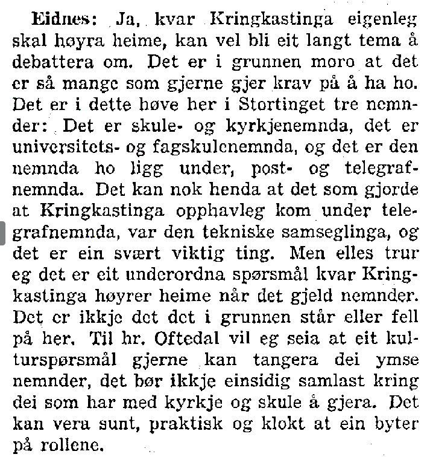
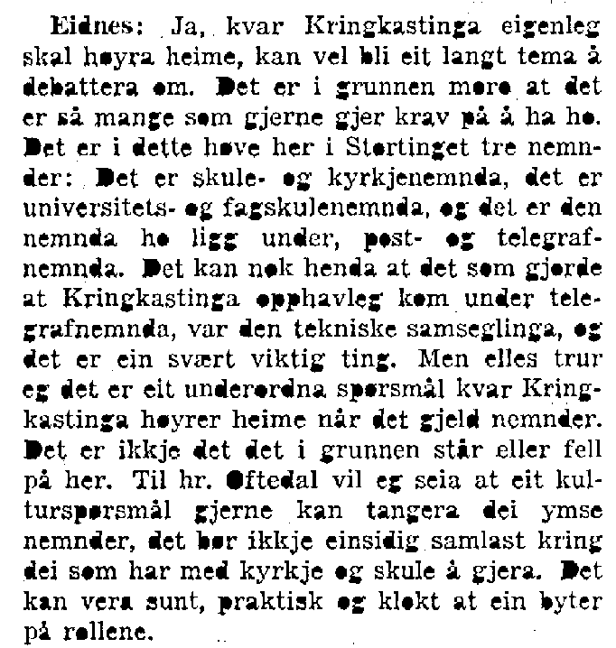
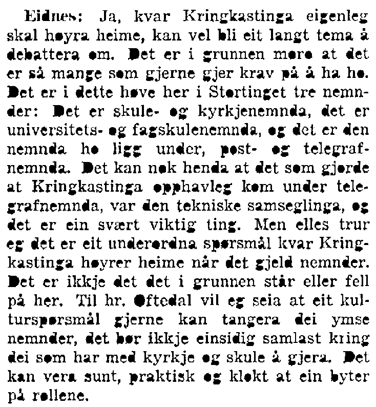
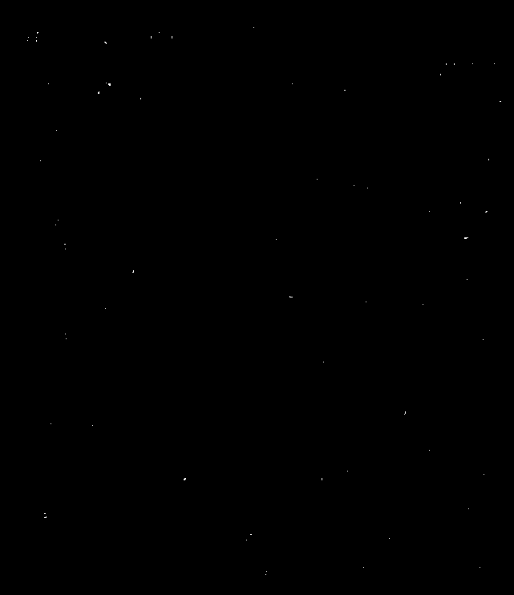
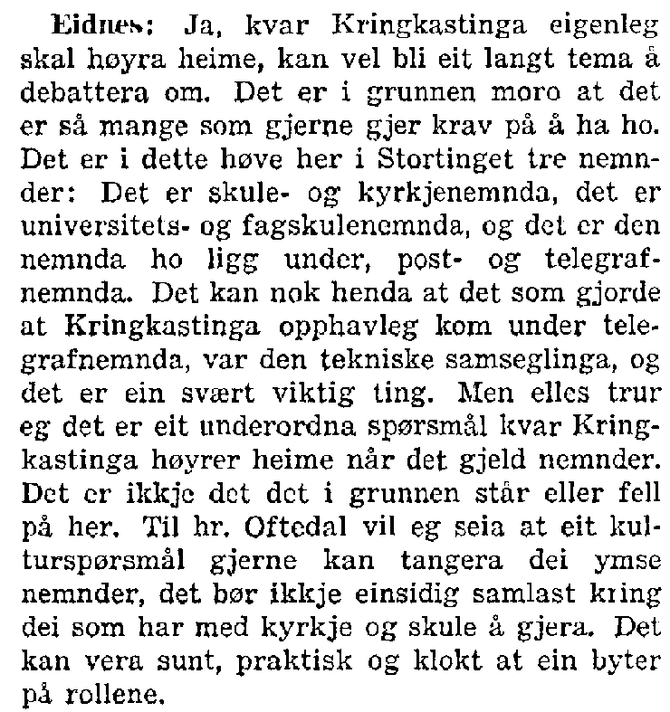

# stortingOCR
This is a work in progress with the goal of converting and structuring the non-digitalized post-war minutes from the Norwegian parliament (1945-2005). More specifically, I am processing images in pdf format with [ImageMagick](http://www.imagemagick.org/) to reduce noise and induce sharpness, and then use [Tesseract-OCR](https://github.com/tesseract-ocr) to optically read the text from the processed images.

The pdfs are downloaded form the [Norwegian National Library](https://www.nb.no), whereas the image processing is mainly based on a problem solution by user *fmw42* on [imagemagic discussion forum](http://www.imagemagick.org/discourse-server/viewtopic.php?t=26571#p117130).

### OS
The project is built and maintained in Linux. However, future tests could be made on the new [Windows Subsystem for Linux](http://www.howtogeek.com/249966/how-to-install-and-use-the-linux-bash-shell-on-windows-10/), and MacOS.

Git, ImageMagick, and Tesseract-OCR needs to be installed in order for the scripts to run.

### Image converting

1. Getting pdfs and splitting into single pages at the following quality:

  

2. Converting to .png format, changing DPI to 300x300 (optimal for tesseract), and shaving of the edges:

  

3. Removing some of the gray noise with LAT (20x20x20%) and enhance blackness of text:

  

4. Making a baseline image with -connected-components:

  

5. The same operation as previous point, only now removing spots of black that are less than 15 pixels big:

  

6. Then take the difference between the two previous operations making a black background with spots of white where the noise filtered out in step 5 was:

  

7. Finally, take the difference between the image from step 3 and 6 to remove the noise:

  

8. Run `tesseract` on the final image to get the result ( Notice that the top of the "s" in Eidnes is cut off in the final image, but is still read as an "s" by tesseract):
__________

Eidnes: Ja, kvar Kringkastinga eigenleg
skal høyra heime, kan vel bli eit langt tema å
debattere om. Det er i grunnen moro at det
er så mange som gjerne gjer krav på å ha ho.
Det er i dette høve her i Stortinget tre nemn-
der: Det er skule- og kyrkjenemnda, det er
universitets- og fagskulenemnda, og det er den
nemnda ho ligg under, post- og telegraf-
nemnda. Det kan nok henda at det som gjorde
at Kringkastinga opphavleg kom under tele-
grafnemnda, var den tekniske samseglinga, og
det er ein svært viktig ting. Men elles trur
eg det er eit underordna spørsmål kvar Kring-
kastinga høyrer heime når det gjeld nemnder.
Det er ikkje det det i grunnen står eller fell
på her. Til hr. Oftedal vil eg seia at eit kul-
turspørsmål gjerne kan tangera dei ymse
nemnder, det bør ikkje einsidig samlast kring
dei som har med kyrkje og skule å gjera. Det
kan vera sunt, praktisk og klokt at ein byter
på rollene.

___
